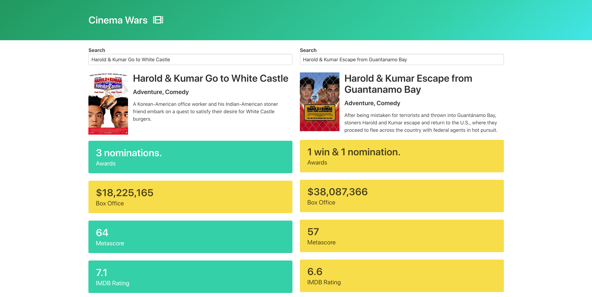

# cinema-wars

Can't decide on which movie to watch? Let the data compare two different movies so you'll know which is the better of the two!



---

## Overview


To use the application, you will need to obtain a free API key from OMDB first.

Once you have this key, update `index.js` in the two areas in that require the `apiKey` parameter:

```js
params: {
      apikey: "xxxxxxx",
      i: movie.imdbID,
    },
```

Then just open `index.html` in your web browser of choice and search for a movie!

---

## Technologies & Frameworks

- [Bulma](https://bulma.io/)
- [OMDB API](http://omdbapi.com/)
